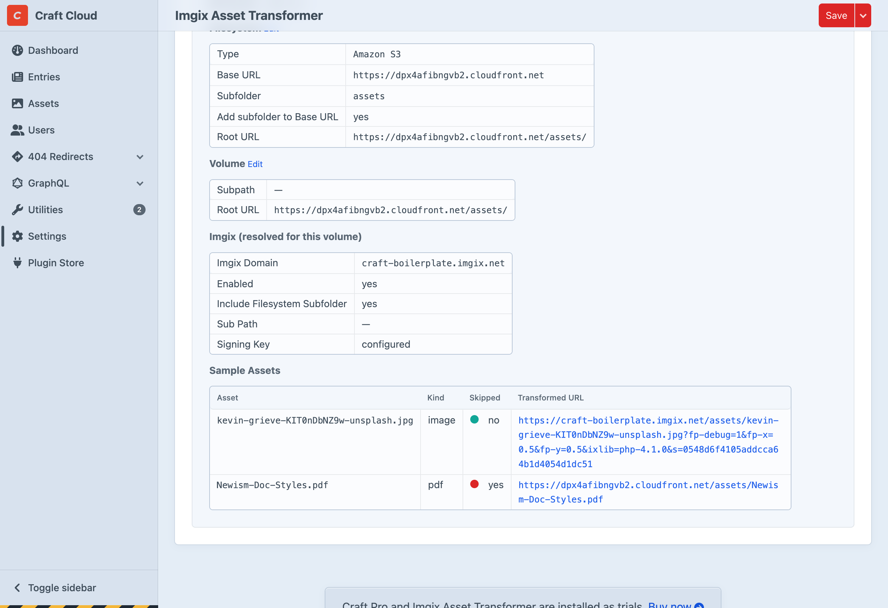

# Configuration

Configuration is managed through a `config/newism-imgix.php` config file.

A config file should have been automatically copied to `config/newism-imgix.php` on installation. If it wasn't, create a `newism-imgix.php` file under your `/config` directory.

A sample config file is available in the plugin's `src/config` directory you can copy it from there:

```shell
cp vendor/newism/craft-imgix/src/config.php config/newism-imgix.php
```

## Configuration options

All scalar settings can also be set via environment variables with the `CRAFT_IMGIX_` prefix. ENV vars always take precedence over config file values.

### Plugin Settings

:::config
setting: enabled
env: CRAFT_IMGIX_ENABLED
type: bool
default: true
---
Globally enable or disable Imgix URL generation
:::

:::config
setting: devMode
env: CRAFT_IMGIX_DEV_MODE
type: bool
default: false
---
Overlay transform mode information on images for debugging
:::

### Imgix Settings

:::config
setting: imgixDomain
env: CRAFT_IMGIX_DOMAIN
type: string
default: ''
---
Your [Imgix source domain](https://docs.imgix.com/en-US/setup/creating-sources) (e.g. `your-source.imgix.net`)
:::

:::config
setting: imgixDefaultParams
type: array|callable
default: []
---
Default [mgix rendering parameters](https://docs.imgix.com/en-US/apis/rendering) applied to all images. 

These can be overridden by transform-specific parameters.

```php
// As a static array
'imgixDefaultParams' => [
    'auto' => 'format,compress',
    'cs' => 'srgb',
],

// Or as a callable for per-asset defaults
'imgixDefaultParams' => function(\craft\elements\Asset $asset, ?\craft\models\ImageTransform $transform = null) {
    return [
        'auto' => 'format,compress',
        'cs' => 'srgb',
    ];
},
```

:::

:::config
setting: signingKey
env: CRAFT_IMGIX_SIGNING_KEY
type: string
default: ''
---
[Secure URL signing key](https://docs.imgix.com/en-US/setup/securing-images). Leave blank to disable signing.

It is recommended to use a signing key in production to prevent abuse of your Imgix source by third parties, but you can leave it blank during development if you prefer.
:::

:::config
setting: purgeApiKey
env: CRAFT_IMGIX_PURGE_API_KEY
type: string
default: ''
---
[Imgix API key](https://dashboard.imgix.com/api-keys) for cache purging. Leave blank to disable purge functionality
:::

:::config
setting: apiBaseUri
env: CRAFT_IMGIX_API_BASE_URI
type: string
default: ''
---
Override the Imgix API base URI (for testing/stubbing)
:::

:::config
setting: debugLogging
env: CRAFT_IMGIX_DEBUG_LOGGING
type: bool
default: false
---
Log purge API requests and responses to `storage/logs/newism-imgix.log`
:::

:::config
setting: skipTransform
type: callable|bool
default: skips non-images
---
A callback that receives the Asset and ImageTransform and returns `true` to skip Imgix and fall back to the filesystem URL.

By default, non-image assets (`$asset->kind !== 'image'`) are skipped to avoid unnecessary [Imgix delivery credits](./minimize-imgix-costs.md). To route all assets through Imgix:

```php
'skipTransform' => false,
```

To customise the skip logic:

```php
'skipTransform' => function(\craft\elements\Asset $asset, ?\craft\models\ImageTransform $transform = null) {
    // Only use Imgix when a transform is explicitly applied
    return $transform === null;
},
```
:::

### Path Resolution Settings

:::config
setting: includeFilesystemSubfolder
env: CRAFT_IMGIX_INCLUDE_FILESYSTEM_SUBFOLDER
type: bool
default: true
---
Include the filesystem's subfolder (e.g. S3 bucket subfolder) in the Imgix path (see [Path Configuration](#path-configuration))
:::

### Volume overrides

:::config
setting: volumes
type: array
default: []
---
Override any setting on a per-volume basis using the volume handle as the key. Per-volume settings use the `VolumeSettings` model which supports fluent syntax:

```php
use Newism\Imgix\models\VolumeSettings;

return [
    'imgixDomain' => 'default.imgix.net',
    'volumes' => [
        'images' => VolumeSettings::create()
            ->imgixDomain('images.imgix.net')
            ->imgixDefaultParams(['auto' => 'format,compress']),
        'documents' => VolumeSettings::create()
            ->enabled(false),
    ],
];
```
:::

## Path Configuration

Getting the Imgix path right is the most important part of the setup. The path the plugin sends to Imgix must match how Imgix reaches the file on your origin (S3, GCS, web server, etc.).

The plugin builds the path from individual components — it does **not** parse the filesystem URL:

* Filesystem  subfolder: included if `includeFilesystemSubfolder` is true
* Volume subpath: always included
* Asset folder path: user folders in CP
* Filename: the file

Final URL:  
`{filesystem subfolder}/{volume subpath}/{asset folder path}/{filename}`

For example, with an S3 filesystem configured with subfolder `assets/`:

```
Filesystem subfolder:  assets/
Volume subpath:        (none)
Asset folder + file:   Photos/beach.jpg

→ Imgix path: /assets/Photos/beach.jpg
→ Imgix URL:  https://your-source.imgix.net/assets/Photos/beach.jpg?w=800&...
```

### Common Setups

#### Simple (one S3 bucket, no subfolder)

No path settings needed. The volume subpath and asset path are included automatically.

```php
'imgixDomain' => 'your-source.imgix.net',
```

#### S3 with subfolder, Imgix has NO path prefix

The default `includeFilesystemSubfolder: true` handles this — the S3 subfolder is included in the Imgix path.

```php
'imgixDomain' => 'your-source.imgix.net',
```

#### S3 with subfolder, Imgix source has a matching path prefix

Disable `includeFilesystemSubfolder` since Imgix already prepends the subfolder via its own Path Prefix setting. Otherwise the subfolder appears twice.

```php
'imgixDomain' => 'your-source.imgix.net',
'includeFilesystemSubfolder' => false,
```

#### Multiple volumes on one Imgix web folder source

Use per-volume `subPath` to route each volume to the correct folder on the origin server:

```php
use Newism\Imgix\models\VolumeSettings;

return [
    'imgixDomain' => 'your-source.imgix.net',
    'volumes' => [
        'images' => VolumeSettings::create()
            ->subPath('images'),
        'documents' => VolumeSettings::create()
            ->subPath('documents'),
    ],
];
```

## Debugging Configuration

The plugin settings page (**Settings > Plugins > Imgix**) includes a comprehensive configuration debugging screen that makes it easy to verify your configuration. 

### Configuration summary

At the top it shows output of all config settings after they have been processed.

### Volume settings

For each volume it shows:

- **Filesystem details** — type, base URL, subfolder, and the resolved root URL
- **Volume details** — subpath and root URL
- **Imgix settings** — the resolved settings for this volume (after merging global + per-volume overrides)
- **Sample assets** — real assets from the volume showing whether they're routed through Imgix or served from the filesystem, with the final URL



In the sample assets table:
- **Skipped: no** (green) — the output URL is an Imgix URL
- **Skipped: yes** (red) — the output URL is the filesystem URL (e.g. S3/CloudFront)

Use this to verify that:
1. Image URLs point to your Imgix domain with the correct path
2. Non-image assets fall back to the filesystem URL
3. The filesystem subfolder and volume subpath are included/excluded as expected


